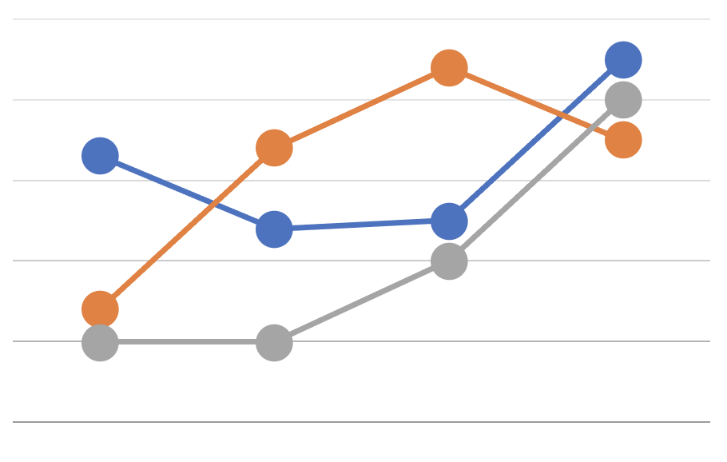

<!--
MIT License

Copyright (c) 2018 Othneil Drew

Permission is hereby granted, free of charge, to any person obtaining a copy
of this software and associated documentation files (the "Software"), to deal
in the Software without restriction, including without limitation the rights
to use, copy, modify, merge, publish, distribute, sublicense, and/or sell
copies of the Software, and to permit persons to whom the Software is
furnished to do so, subject to the following conditions:

The above copyright notice and this permission notice shall be included in all
copies or substantial portions of the Software.

THE SOFTWARE IS PROVIDED "AS IS", WITHOUT WARRANTY OF ANY KIND, EXPRESS OR
IMPLIED, INCLUDING BUT NOT LIMITED TO THE WARRANTIES OF MERCHANTABILITY,
FITNESS FOR A PARTICULAR PURPOSE AND NONINFRINGEMENT. IN NO EVENT SHALL THE
AUTHORS OR COPYRIGHT HOLDERS BE LIABLE FOR ANY CLAIM, DAMAGES OR OTHER
LIABILITY, WHETHER IN AN ACTION OF CONTRACT, TORT OR OTHERWISE, ARISING FROM,
OUT OF OR IN CONNECTION WITH THE SOFTWARE OR THE USE OR OTHER DEALINGS IN THE
SOFTWARE.
-->

<!--
*** Thanks for checking out the Best-README-Template. If you have a suggestion
*** that would make this better, please fork the repo and create a pull request
*** or simply open an issue with the tag "enhancement".
*** Thanks again! Now go create something AMAZING! :D
***
***
***
*** To avoid retyping too much info. Do a search and replace for the following:
*** marakeby, clinicalNLP2, twitter_handle, email, clinical NLP, project_description
-->


<!-- PROJECT SHIELDS -->
<!--
*** I'm using markdown "reference style" links for readability.
*** Reference links are enclosed in brackets [ ] instead of parentheses ( ).
*** See the bottom of this document for the declaration of the reference variables
*** for contributors-url, forks-url, etc. This is an optional, concise syntax you may use.
*** https://www.markdownguide.org/basic-syntax/#reference-style-links
-->
[![Contributors][contributors-shield]][contributors-url]
[![Forks][forks-shield]][forks-url]
[![Stargazers][stars-shield]][stars-url]
[![Issues][issues-shield]][issues-url]
[![GPL-2.0 License][license-shield]][license-url]
[![LinkedIn][linkedin-shield]][linkedin-url]


<!-- PROJECT LOGO -->
<br />
<p align="center">
  <a href="https://github.com/marakeby/clinicalNLP2">
    
  </a>

  <h2 align="center">Evaluation of Transformer-based models</h2>

  <p align="center">
<br /> Code to accompany the paper:
<br />
    "Empirical evaluation of language modeling to ascertain cancer outcomes from clinical text reports"
    <br />
    <br />
    <br />

  </p>
</p>


<!-- TABLE OF CONTENTS -->
<details open="open">
  <summary><h2 style="display: inline-block">Table of Contents</h2></summary>
  <ol>
    <li>
      <a href="#about-the-project">About The Project</a>
    </li>
    <li>
      <a href="#getting-started">Getting Started</a>
      <ul>
        <li><a href="#prerequisites">Prerequisites</a></li>
        <li><a href="#installation">Installation</a></li>
      </ul>
    </li>
    <li><a href="#usage">Usage</a></li>
    <li><a href="#References">References</a></li>
    <li><a href="#license">License</a></li>
    <li><a href="#contact">Contact</a></li>
    <li><a href="#acknowledgements">Acknowledgements</a></li>
  </ol>
</details>


<!-- ABOUT THE PROJECT -->
## About The Project

<p align="center">
  <a href="https://github.com/marakeby/clinicalNLP2">
    
  </a>
  </p>
  

Language modeling has become a central tool for modern natural language processing across multiple domains. Here, we evaluated its utility for extracting cancer outcomes data from clinical text reports. This outcomes extraction task is a key rate-limiting step for asking observational cancer research questions intended to promote precision cancer care using large linked clinical and molecular datasets. Traditional medical record annotation is a slow manual process and scaling up this process is critically important to facilitate accurate and fast clinical decision making.

We have previously demonstrated that simple convolutional neural networks (CNNs), trained on a labeled dataset of imaging reports for over 1,000 patients with non-small cell lung cancer, can yield models able to accurately capture key clinical outcomes from each report, including cancer progression/worsening and response/improvement. In the current analysis, we evaluated whether pre-trained Transformer models, with or without domain adaptation using imaging reports from our institution, can improve performance or reduce the volume of training data necessary to yield well-performing models for this document classification task. We did extensive analyses of multiple variants of pre-trained Transformer models considering major modeling factors such as 1) training sample size, 2) classification architecture, 3) language- model fine tuning, 4) classification task, 5) length of text considered, and 6) number of parameters of the Transformer models. We reported the performance results of these models under different considerations.

<!-- GETTING STARTED -->
## Getting Started

To get a local copy up and running, follow these simple steps

### Prerequisites

* python 3.7, check environments.yml for list of needed packages
 

### Installation

1. Clone the repo
   ```sh
   git clone https://github.com/marakeby/clinicalNLP2.git
   ```
2. Create conda environment
   Note that not all packages are needed to generate the paper figures. Some of these packages are needed only for the training purposes. 
   ```sh
   conda env create --name cnlp_env --file=environment.yml
   ```
3. Based on your use, you may need to download one or more of the following 

    a. [Log files](https://drive.google.com/uc?id=1xHdnhAYU0Q0fTCMJ8hEttu3lKjEA9KpV&export=download) (needed to regenerate paper figures). Extract the files under ```_cnlp_results``` directory. If you like to store it somewhere else, you may need to set the ```TEST_RESULTS_PATH``` variable in ```config_path.py``` accordingly.
  
    b. [Plots files](https://drive.google.com/uc?id=16FxBUhVgLKJA_QrxUfk8yzcTNAR9D0ll&export=download) (a copy of the paper images). Extract the files under ```_cnlp_plots``` directory. If you like to store it somewhere else, you may need to set the ```PLOTS_PATH``` variable in ```config_path.py``` accordingly.


<!-- USAGE EXAMPLES -->
## Usage

1. Activate the created conda environment
   ```sh
   source activate cnlp_env
   ```
2. Add the current diretory to PYTHONPATH, e.g. 

   ```sh
   export PYTHONPATH=~/clinicalNLP2:$PYTHONPATH
   ```
   
3. To generate all paper figures, run 
     ```sh
   cd ./paper_analysis
   python generate_figures.py
   ```
   
4. To generate individual paper figure run the different files under the 'paper_analysis_revision2' directory, e.g. 
     ```sh
   cd ./paper_analysis_revision2
   python figure_4_samples_sizes.py
   ```
     
5. To re-train a model from scratch run 
   ```sh
   cd ./train
   python run_testing.py
   ```
    This will run an experiment ```bert_classifier/progression_one_split_BERT_sizes_tiny_frozen_tuned``` which trains a model to predict progression of cancer patients using a fine-tuned tiny BERT model under different size of the training set. 
    The results of the experiment will be stored under ```_logs```in a directory with the same name as the experiment. To run another experiment, you may uncomment one of the lines in the run_testing.py to run the corresponding experiment. 
  <br />
<br />
   Note that the underlying EHR text reports used to train and evaluate NLP models for these analyses constitute protected health information for DFCI patients and therefore cannot be made publicly available. Researchers with DFCI appointments and Institutional Review Board (IRB) approval can access the data on request. For external researchers, access would require collaboration with the authors and eligibility for a DFCI appointment per DFCI policies

<!-- LICENSE -->
## License

Distributed under the GPL-2.0 License License. See `LICENSE` for more information.


<!-- CONTACT -->
## Contact

Haitham - [@HMarakeby](https://twitter.com/HMarakeby) 

Project Link: [https://github.com/marakeby/clinicalNLP2](https://github.com/marakeby/clinicalNLP2)


<!-- References -->
## References

* Elmarakeby, H, et al. "Empirical evaluation of language modeling to ascertain cancer outcomes from clinical text reports"
* Kehl, K. L., Elmarakeby, H., Nishino, M., Van Allen, E. M., Lepisto, E. M., Hassett, M. J., ... & Schrag, D. (2019). Assessment of deep natural language processing in ascertaining oncologic outcomes from radiology reports. JAMA oncology, 5(10), 1421-1429.
* Kehl, K. L., Xu, W., Gusev, A., Bakouny, Z., Choueiri, T. K., Riaz, I. B., ... & Schrag, D. (2021). Artificial intelligence-aided clinical annotation of a large multi-cancer genomic dataset. Nature communications, 12(1), 1-9.
* Kehl, K. L., Xu, W., Lepisto, E., Elmarakeby, H., Hassett, M. J., Van Allen, E. M., ... & Schrag, D. (2020). Natural language processing to ascertain cancer outcomes from medical oncologist notes. JCO Clinical Cancer Informatics, 4, 680-690.

[//]: # (<!-- ACKNOWLEDGEMENTS -->)

## Acknowledgements
* National Cancer Institute (NCI), 
* Doris Duke Charitable Foundation, 
* Department of Defense (DoD), 
* Mark Foundation Emerging Leader Award, 
* PCF-Movember Challenge Award


<!-- MARKDOWN LINKS & IMAGES -->
<!-- https://www.markdownguide.org/basic-syntax/#reference-style-links -->
[contributors-shield]: https://img.shields.io/github/contributors/marakeby/clinicalNLP2.svg?style=for-the-badge
[contributors-url]: https://github.com/marakeby/clinicalNLP2/graphs/contributors
[forks-shield]: https://img.shields.io/github/forks/marakeby/clinicalNLP2.svg?style=for-the-badge
[forks-url]: https://github.com/marakeby/clinicalNLP2/network/members
[stars-shield]: https://img.shields.io/github/stars/marakeby/clinicalNLP2.svg?style=for-the-badge
[stars-url]: https://github.com/marakeby/clinicalNLP2/stargazers
[issues-shield]: https://img.shields.io/github/issues/marakeby/clinicalNLP2.svg?style=for-the-badge
[issues-url]: https://github.com/marakeby/clinicalNLP2/issues
[license-shield]: https://img.shields.io/github/license/marakeby/clinicalNLP2.svg?style=for-the-badge
[license-url]: https://github.com/marakeby/clinicalNLP2/blob/master/LICENSE.txt
[linkedin-shield]: https://img.shields.io/badge/-LinkedIn-black.svg?style=for-the-badge&logo=linkedin&colorB=555
[linkedin-url]: https://linkedin.com/in/haitham-elmarakeby-29030119
